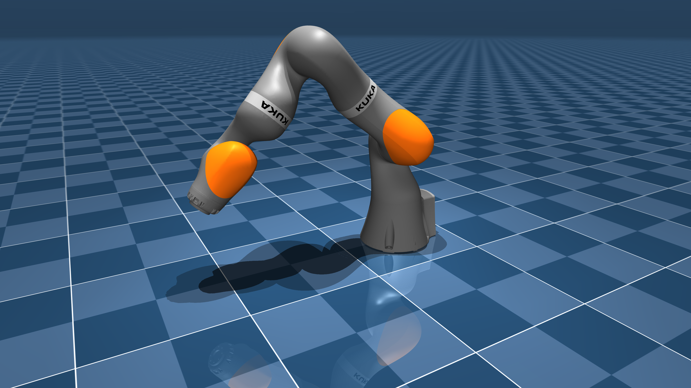

# KUKA LBR iiwa 14 Forward Kinematics (POE based) Verifiction

Requires MuJoCo 2.3.3 or later.

# MuJoCo Robotics Project

This package contains a simplified robot description (MJCF) of the [LBR iiwa](https://www.kuka.com/en-us/products/robotics-systems/industrial-robots/lbr-iiwa) 14kg developed by [mujoco_menagerie](https://www.bing.com/search?pglt=673&q=mujoco_menagerie&cvid=8f9cd7201ba741a7aa50020d20a1cfc5&gs_lcrp=EgZjaHJvbWUyBggAEEUYOdIBCDEwMjhqMGoxqAIAsAIA&FORM=ANNTA1&PC=U531) developers. 
I have added the C++ implementation of robotics algorithms using MuJoCo for simulation and visualization. It includes forward kinematics based on the product of exponential and verified using mujoco. be aware that the code is not clean !!

<p float="left">
  
</p>


## Prerequisites

- CMake (version 3.10 or higher)
- C++17 compatible compiler
- MuJoCo
- GLFW3
- Eigen3

## Project Structure

The project is organized as follows:

- `src/`: Contains the main source code files
- `include/`: Contains header files
- `tests/`: Contains test files
- `CMakeLists.txt`: Main CMake configuration file

## Building the Project

1. Create a build directory:
   ```
   mkdir build && cd build
   ```

2. Run CMake:
   ```
   cmake ..
   ```

3. Build the project:
   ```
   make
   ```

## Running the Project

After building, you can run the main executable:

```
./src/main
```

## Running Tests

To run the tests, use the following command from the build directory:

```
ctest
```

## Key Features

- POE base Forward kinematics calculations and its verification with mujoco 
- MuJoCo integration for robot simulation
- GLFW for visualization
- Eigen library for matrix operations
- Unit tests using Google Test framework

## License


## Contributing


## Contact


